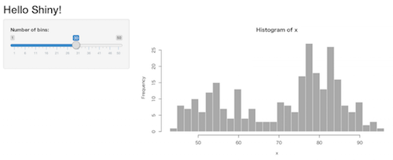
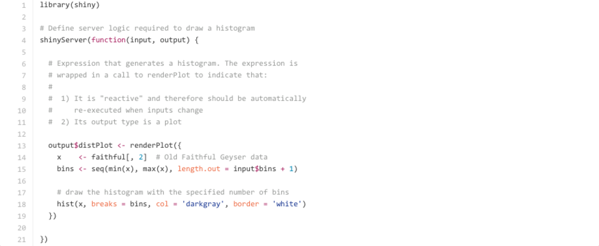

---
# Lab.note package ver. 0.4.2
title: Hello, Shiny!
subtitle: 
author: \faTwitter @u_ribo
date: "`r format(Sys.time(), '%B %d, %Y')`"
header-includes:
# define macro
    - \definecolor{Black1}{RGB}{43,40,40}
    - \definecolor{White1}{RGB}{255, 255, 250}
    - \definecolor{Blue1}{RGB}{48, 122, 190} \definecolor{Blue2}{RGB}{99, 151, 205}
    - \definecolor{Grey1}{RGB}{164, 173, 185}
# using package, setup
    - \usepackage{zxjatype}
    - \setjamainfont{Hiragino Kaku Gothic Pro}
    - \usepackage{fontspec, fontawesome} # require installed FontAwesome
    - \usepackage{scrextend}
    - \changefontsizes{22pt}
## comment out when if you using image for slide background 
#   - \usebackgroundtemplate{\includegraphics[width = \paperwidth, height = \paperheight]{...png}}
# set beamer theme
    - \setbeamercolor{background canvas}{bg = White1}
    - \setbeamertemplate{navigation symbols}{}
    - \setbeamertemplate{itemize items}{\textcolor{Blue2}{\faCaretRight}}
    - \setbeamerfont{title}{size = \fontsize{38}{10}} \setbeamercolor{title}{fg = Blue1}
    - \setbeamerfont{subtitle}{size = \large} \setbeamercolor{subtitle}{fg = Blue2}
    - \setbeamercolor{author}{fg = Black1} \setbeamercolor{normal text}{fg = Black1}
    - \setbeamerfont{date}{series = \itshape} \setbeamercolor{date}{fg = Grey1}
    - \setbeamercolor{frametitle}{fg = Blue1}
# new command
    - \renewcommand{\baselinestretch}{1.0}
output:
  beamer_presentation:
    fonttheme: "structurebold"
    keep_tex: false
    pandoc_args:
     ["--latex-engine=xelatex"]
mainfont: Helvetica Neue
monofont: Ricty
linkcolor: blue
urlcolor: red
citecolor: Black1
---

```{r gobal_options, child = "document_setting.Rmd", eval = TRUE}
```

---

\center{Shinyを動かそう}

---

## Shinyを動かすためのディレクトリ

* \faFolderOpen App_name/
    * \faFile \textbf{server.R} （必須）
    * \faFile \textbf{ui.R} （必須）
    * \faFile global.R （なくても良い）
    * \faFolderClose www/ （なくても良い）
        * 画像, CSS, Javescriptなどは「www」というフォルダの中へ
        
## 実際にはこんな感じ

```{r, echo=TRUE}
runExample("01_hello")
```



\scriptsize{\faLink \url{https://github.com/rstudio/shiny-examples/tree/master/001-hello}}

## \large{ui.R... 外観、構造を定義}

```{r, eval=FALSE}
webshot(url = "https://github.com/rstudio/shiny-examples/blob/master/001-hello/ui.R",
        file = "hello_shiny/images/code_ui.r.png",
        selector = "table") %>% resize("1200x")
```


```{r, echo=TRUE, size="tiny"}
shinyUI(fluidPage())
```

## \large{server.R... 動作、機能を定義}

```{r, eval=FALSE}
webshot(url = "https://github.com/rstudio/shiny-examples/blob/master/001-hello/server.R",
        file = "hello_shiny/images/code_server.r.png",
        selector = "table") %>% resize("1200x")
```



```{r, echo=TRUE}
shinyServer(function(input, output) {
})
```

## server.R

* input... 変数名はui.Rで使用するラベル名となる
* **output$**hoge... hoge
    * hogeはui.Rでの出力部で使うラベル
    
## タブ化する

ui.R

```{r, echo=TRUE}
mainPanel(
  tableOutput("view"),
  plotOutput("plot")
)
```

こうする（下）

```{r, echo=TRUE}
mainPanel(
  tabsetPanel(
    tabPanel("Tab name", tableOutput("view")),
    tabPanel("Size class", plotOutput("plot"))
  )
)
```

## shinydashboard

[shinydashboard](http://rstudio.github.io/shinydashboard/index.html)は気軽にShinyを動かせるダッシュボード形式のパッケージ。ShinyAppとは構造が異なるので注意

## 構造

ShinyApp同様、一つのファイル内に処理を書けるが、別々なファイルにすることも可能。

* ui.R
* app.R

## Tips

* Themeを適用... http://rstudio.github.io/shinythemes/


## 複雑...

> shinyUI fluidPage


## Check font size

\center{
  Default 22 pt\\(see line 18 in this file)
  
  \begin{itemize}
    \item \small{small}
    \item \footnotesize{footnotesize}
    \item \scriptsize{scriptsize}
    \item \tiny{tiny}
  \end{itemize}
}

## Check font size

\center{
  Default 22 pt\\(see line 18 in this file)
  
  \begin{itemize}
    \item \Large{Large}, \LARGE{LARGE}
    \item \huge{huge}, \Huge{Huge}
  \end{itemize}
}

## References
